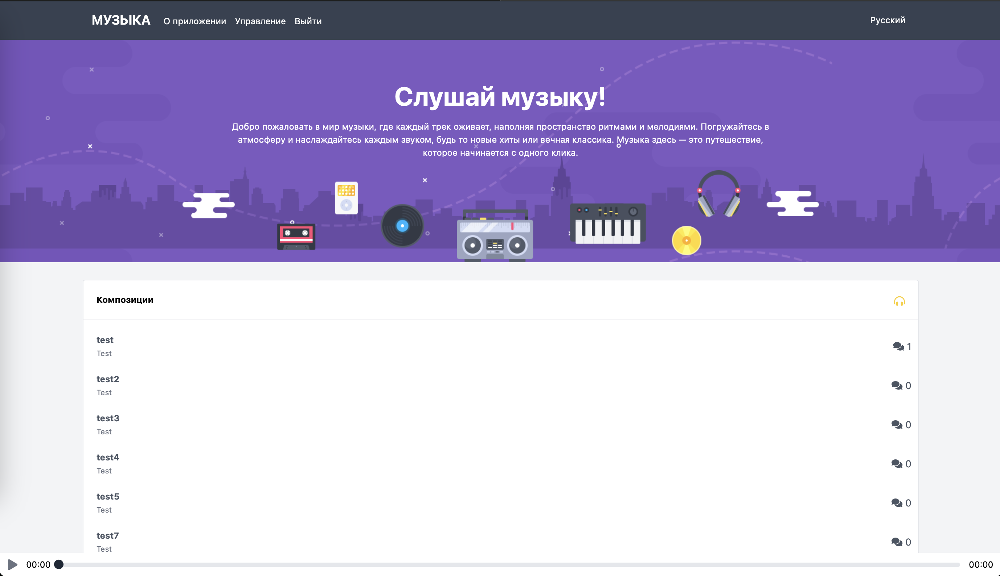
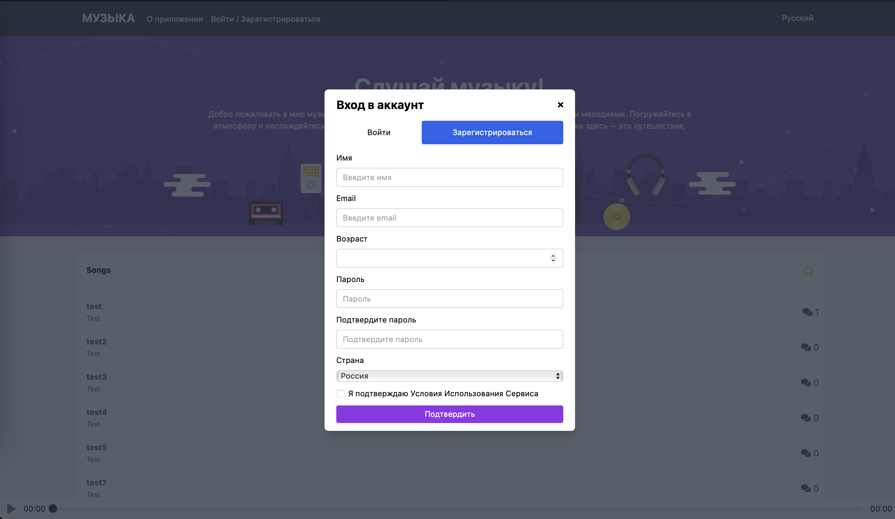
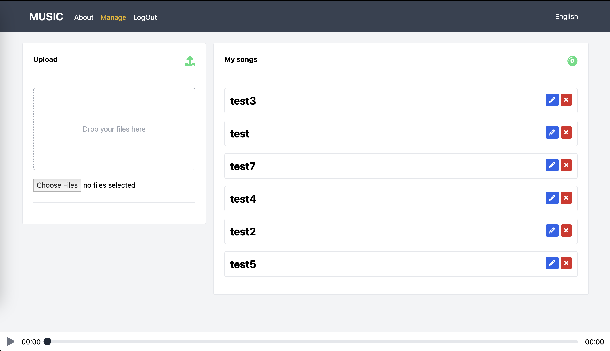
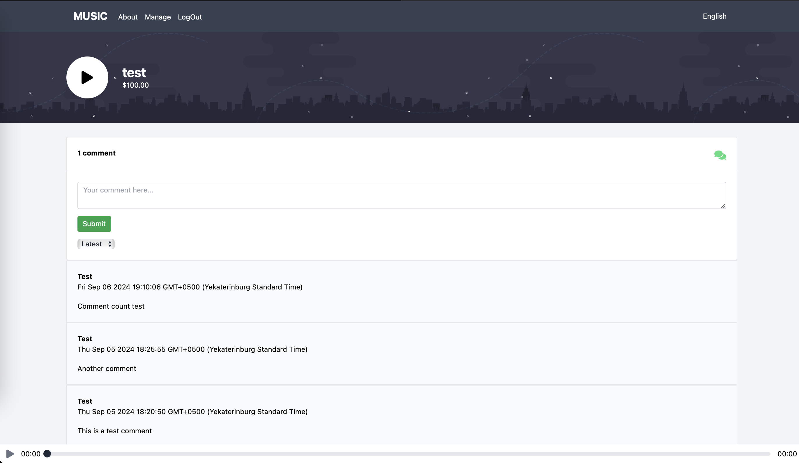

# 🎵 Music Platform на Vue

  

## 📖 О проекте
**Music Platform** — это веб-приложение для прослушивания музыки, разработанное с использованием **Vue 3**, **Vite** и **Firebird**. Проект предоставляет пользователям удобный интерфейс для управления музыкальными треками, создания плейлистов и прослушивания музыки.


<div style="display: flex; flex-wrap: wrap; gap: 16px;">
  <a href="./public/assets/screenshots/Home.png" target="_blank">
    
  </a>
  <a href="./public/assets/screenshots/Register.png" target="_blank">
    
  </a>
  <a href="./public/assets/screenshots/Manage.png" target="_blank">
    
  </a>
  <a href="./public/assets/screenshots/Song.png" target="_blank">
    
  </a>
</div>

[//]: # ()
[//]: # (![Главная страница]&#40;./public/assets/screenshots/Home.png&#41;)
[//]: # (![Регистрация]&#40;./public/assets/screenshots/Register.png&#41;)
[//]: # (![Страница управления композициями]&#40;./public/assets/screenshots/Manage.png&#41;)
[//]: # (![Страница композиции]&#40;./public/assets/screenshots/Song.png&#41;)

## 🛠️ Используемые технологии
- **[Vue 3](https://vuejs.org/)** — современный фреймворк для создания пользовательских интерфейсов.
- **[Vite](https://vitejs.dev/)** — инструмент для быстрой сборки и разработки.
- **[Tailwind CSS](https://tailwindcss.com/)** — утилитарный CSS-фреймворк для создания адаптивного дизайна.
- **[Cypress](https://www.cypress.io/)** и **[Vitest](https://vitest.dev/)** — для End-to-End и Unit тестирования.
- **[Firebase](https://firebase.google.com/)** — облачная платформа для хранения данных пользователей и музыкальных треков, обеспечивающая надежное и эффективное управление данными.

## 🚀 Начало работы

### 📦 Установка
Для запуска проекта локально выполните следующие шаги:

1. Клонируйте репозиторий:
   ```
   git clone https://github.com/mspolermo/music-platform-vue.git
   cd music-platform-vue
   ```
2. Установите зависимости:
```
npm install
```
### 🧑‍💻 Запуск
Для запуска проекта в режиме разработки используйте команду:
```
npm run dev
```
Для сборки проекта в режиме продакшн:
```
npm run build
```
Собранные файлы будут находиться в папке dist.

### ⌨️️ Перевод

В проекте используется библиотека i18next для работы с переводами. Файлы с переводами хранятся в public/locales.


### 🧪 Тестирование
Проект поддерживает юнит-тесты и тесты End-to-End.

Запуск юнит-тестов с использованием Vitest:
```
npm run test:unit
```
Запуск End-to-End тестов с Cypress в dev-среде:
```
npm run test:e2e:dev
```
### 🧹 Линтинг
Для запуска линтера используйте команду:
```
npm run lint
```
### 🌐 Деплой
Демонстрационный проект [опубликован](https://music-platform-a8axons85-mspolermos-projects.vercel.app) с помощью Vercel.
Авторизационные данные тестового пользователя:
```
login: test@test.com
password: 123456789
```
